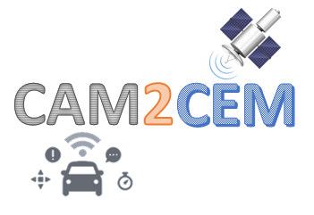

# ms-van3t CAM2CEM version

This repository is a fork of the [ms-van3t](https://github.com/marcomali/ms-van3t) V2X simulation and emulation framework, with additional modules for testing a novel approach to the transmission of raw GNSS data between vehicles.

In particular, this repository contains the first implementation of a proposed Cooperative Enhancement Basic Service (CE Basic Service), together with the definition of a new, ETSI-compatible, ASN1 V2X message, called CEM (Cooperative Enhancement Message - proposed messageID: *200*).

The CEM .asn1 file (v1.2.2), which is released under the same license as this repository, and which is thus thought to be open, can be found inside `ns-3.33/src/automotive/asn1_files`.

**Remember that this repository is work-in-progress and specifically thought for the development, testing, and validation of the new proposed CEM messages. If you need a stable environment for testing V2X applications, use the main ms-van3t repository instead!**

You can currently use this repository for testing the current version of the CE Basic Service and the CEM protocol by relying on two different V2V access technologies, i.e., IEEE 802.11p and C-V2X Mode 4.

The current public repository allows the user to set up any scenario on SUMO, and have the vehicles exchange sample CEM messages. These sample messages contain sample data, i.e., the same data values and types of real CEM messages, but with no direct relationship to the position of the vehicle inside the SUMO scenario. This repository can thus be used only to evaluate **network-related metrics** when transmitting CEM messages (network usage, PDR, latency, throughput, and so on), and **not yet** real cooperative positioning applications, which would require each SUMO vehicle to be equipped with a real raw GNSS trace consistent with the position of each vehicle inside the simulated scenario. In this repository, each vehicle is equipped with the same raw GNSS sample trace.

A public version leveraging a real dataset of 19 vehicles and real, consistent, raw GNSS traces (one for each vehicle) for the evaluation of actual cooperative positioning applications (and related application-related KPIs) is currently under development and is scheduled to be made public soon.

**Important:** before launching and/or customizing any of the CEM sample applications, it is highly recommended to get familiar with ms-van3t and read the main ms-van3t README, available [here](https://github.com/marcomali/ms-van3t).

**Note:** the SUMO files defining the scenario for the two CEM sample applications can be found inside `ns-3.33/src/automotive/examples/sumo_files_v2i_map`. The `traces-additionals` folder contains some additional traces, with different numbers of vehicles, to be used in conjunction with the already available `map.net.xml` (if you want to use one of them, you should move it inside `ns-3.33/src/automotive/examples/sumo_files_v2i_map` and rename it to `cars.rou.xml`).

## IEEE 802.11p

The IEEE 802.11p access technology sample application relies on a V2V scenario with eight regulated intersections. All the vehicles are configured to send both CAMs and CEMs.

The simulation can be started with:

`./waf --run "v2v-80211p-gps-raw-tc-example --sumo-gui=true"`

You can customize when the vehicles will start transmitting CAMs and CEMs with `--dissemination-delay`. The CAMs and CEMs will be then transmitted for 100 s after the specified delay or after the beginning of the simulation if no delay is specified. This is due to the length of the raw GNSS trace which is currently available. You can also set the maximum simulation time with `--sim-time` (normally, this time should be at least equal to the dissemination delay plus 100 seconds, to complete a full simulation).

After the simulation, you will find, inside the main ns-3.33 folder:
- a new CSV file, named `gps-raw-tc-log<n>.csv`, where `<n>` is the number of vehicles in the current SUMO trace (the default trace has 10 vehicles).
- several `.pcapng` files, inside which you will find several Wireshark captures containing the messages exchanged by the vehicles. The CEM messages will be labeled as `BTPB`, as there is currently no Wireshark dissector for this proposed message type.

In this sample application, the transmission power has been set to a value such that all the vehicles can communicate with all the others, to enable a reliable computation of the Packet Delivery Ratio. A new version, enabling the evaluation of the PDR according to the 3GPP TR36.885 V14.0.0 standard for any value of *txpower*, is currently under development and it should be available soon (this metric is already available in the main ms-van3t version).

## C-V2X

The 3GPP C-V2X Mode 4 access technology sample application relies on a V2V scenario with eight regulated intersections. All the vehicles are configured to send both CAMs and CEMs.

The simulation can be started with:

`./waf --run "v2v-cv2x-gps-raw-tc-example --sumo-gui=true"`

You can customize when the vehicles will start transmitting CAMs and CEMs with `--dissemination-delay`. The CAMs and CEMs will be then transmitted for 100 s after the specified delay or after the beginning of the simulation if no delay is specified. This is due to the length of the raw GNSS trace which is currently available. You can also set the maximum simulation time with `--sim-time` (normally, this time should be at least equal to the dissemination delay plus 100 seconds, to complete a full simulation).

You can also disable the CEM transmission (leaving only the CAM messages) with `--send-cem=false`

After the simulation, you will find, inside the main ns-3.33 folder:
- a new CSV file, named `gps-raw-tc-log<n>.csv`, where `<n>` is the number of vehicles in the current SUMO trace (the default trace has 10 vehicles). This file contains some useful network-related metrics, for each vehicle in the scenario.

In this sample application, the transmission power has been set to a value such that all the vehicles can communicate with all the others, to enable a reliable computation of the Packet Delivery Ratio. A new version, enabling the evaluation of the PDR according to the 3GPP TR36.885 V14.0.0 standard for any value of *txpower*, is currently under development and it should be available soon (this metric is already available in the main ms-van3t version).

## Acknowledgements

*To be completed as soon as our paper is published.* 

Currently, we have one accepted conference paper which is going to be published soon. As soon as it is officially published, we will update this section of the README accordingly.
